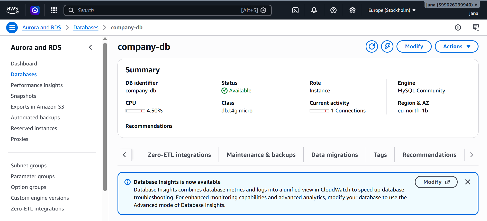
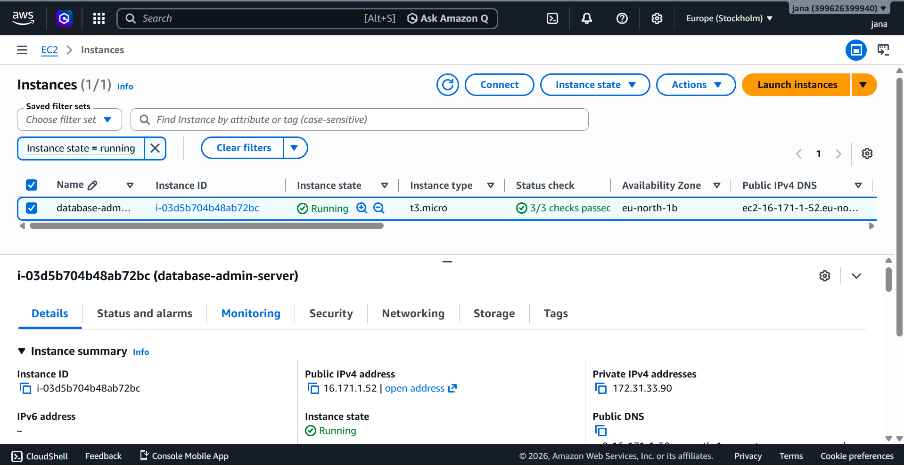
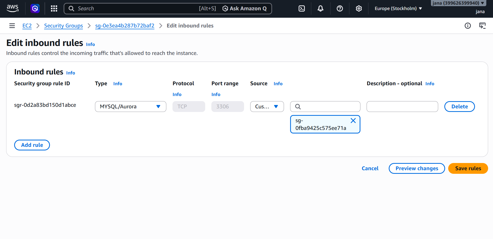
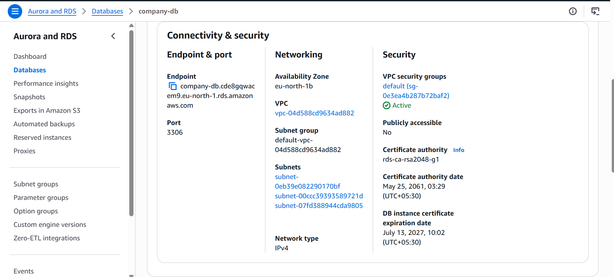
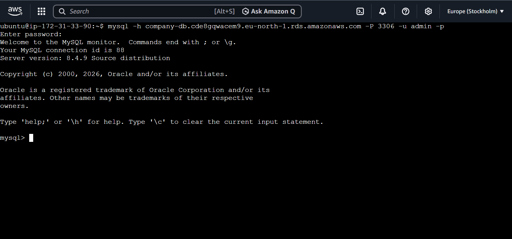
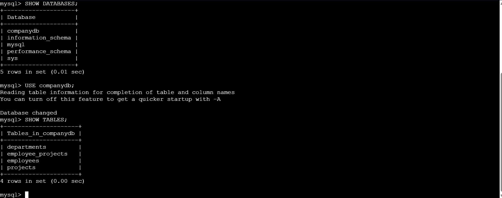
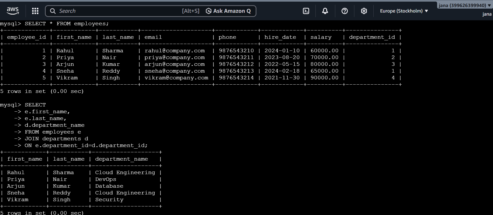
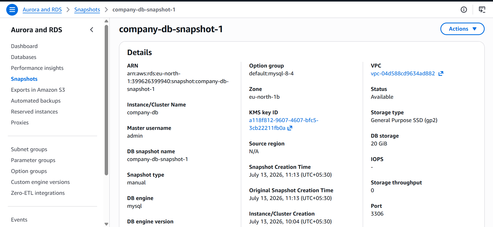

# AWS RDS Database Management

Enterprise database administration project using Amazon RDS, Amazon EC2, SQL, CloudWatch, Security Groups, and RDS Snapshots.
# AWS RDS Database Management

A hands-on AWS Cloud project demonstrating secure deployment and administration of a MySQL database using **Amazon RDS**. The project showcases database provisioning, secure networking, SQL operations, monitoring, backups, and infrastructure best practices using AWS services.

---

## Project Overview

This project demonstrates how to deploy and manage a relational database in AWS using Amazon RDS while following cloud security best practices.

An Ubuntu EC2 instance was configured as a database administration server. Secure communication between EC2 and RDS was established using Security Groups, allowing MySQL traffic only from the EC2 instance. The database was populated with sample data, SQL queries were executed, CloudWatch metrics were monitored, and manual snapshots were created for backup and recovery.

---

## Architecture

---

## AWS Services Used

| Service | Purpose |
|----------|---------|
| Amazon EC2 | Database administration server |
| Amazon RDS (MySQL) | Managed relational database |
| Amazon VPC | Secure network isolation |
| Security Groups | Restrict database access |
| Amazon CloudWatch | Database monitoring |
| Amazon RDS Snapshots | Backup and recovery |
| Linux (Ubuntu) | Database administration environment |
| MySQL Client | Database connectivity |

---

## Project Architecture

Administrator

↓

SSH (Port 22)

↓

Amazon EC2 (Ubuntu)

↓

MySQL Client

↓

Security Group

↓

Amazon RDS (MySQL)

↓

Company Database

↓

CloudWatch Monitoring

↓

RDS Snapshots

---

## Features

- Provisioned Amazon RDS MySQL database
- Configured secure VPC networking
- Restricted database access using Security Groups
- Connected Amazon EC2 to Amazon RDS
- Installed and configured MySQL Client
- Created relational database schema
- Inserted sample records
- Executed SQL queries and JOIN operations
- Managed database users and privileges
- Created manual RDS snapshots
- Monitored database performance using Amazon CloudWatch
- Followed AWS security best practices

---

## Project Workflow

1. Launch Ubuntu EC2 instance
2. Create Amazon RDS MySQL instance
3. Configure Security Groups
4. Connect EC2 to RDS
5. Install MySQL Client
6. Create database schema
7. Insert sample data
8. Execute SQL queries
9. Monitor database using CloudWatch
10. Create RDS Snapshot

---

## SQL Operations

### Database Creation

- Created relational database
- Designed normalized schema
- Implemented primary keys
- Implemented foreign keys

### Data Management

- Insert
- Update
- Delete
- Select

### Query Operations

- Aggregate Functions
- JOIN Operations
- Filtering
- Sorting
- Counting
- Average Salary Calculation

### User Management

- Created database users
- Assigned privileges
- Managed access permissions

---

## Security Configuration

- RDS instance is not publicly accessible
- Database access restricted through Security Groups
- Only the EC2 Security Group can communicate with the database
- MySQL communication allowed only on Port 3306
- Principle of least privilege followed for database access

---

## Monitoring

Amazon CloudWatch was used to monitor:

- CPU Utilization
- Database Connections
- Read IOPS
- Write IOPS
- Free Storage Space
- Database Performance Metrics

---

## Backup & Recovery

- Manual RDS Snapshot
- Automated Backups
- Point-in-Time Recovery (Supported)
- Snapshot-based Restore

---

## Project Screenshots

### Amazon RDS Dashboard

---

### EC2 Instance

---

### Security Group Configuration

---

### RDS Connectivity

---

### MySQL Connection from EC2

---

### Database Tables

---

### SQL Query Execution

---

### CloudWatch Monitoring

---

### Manual Snapshot

---

## Skills Demonstrated

- Amazon EC2
- Amazon RDS
- MySQL
- SQL
- Amazon VPC
- Security Groups
- CloudWatch
- RDS Snapshots
- Linux Administration
- Networking Fundamentals
- Database Administration
- Infrastructure Security
- AWS Cloud Services

---

## Learning Outcomes

This project provided practical experience in deploying and administering managed databases on AWS. It strengthened knowledge of relational database design, secure networking, database connectivity, monitoring, backup strategies, and cloud infrastructure management following AWS best practices.

---

